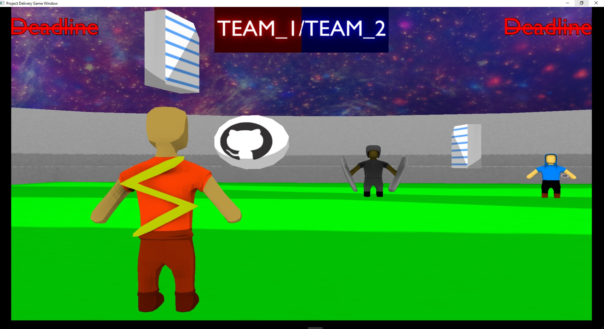
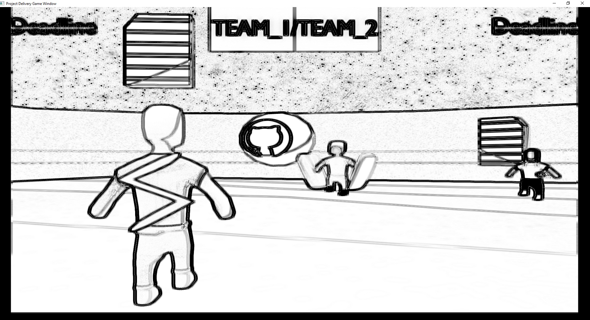
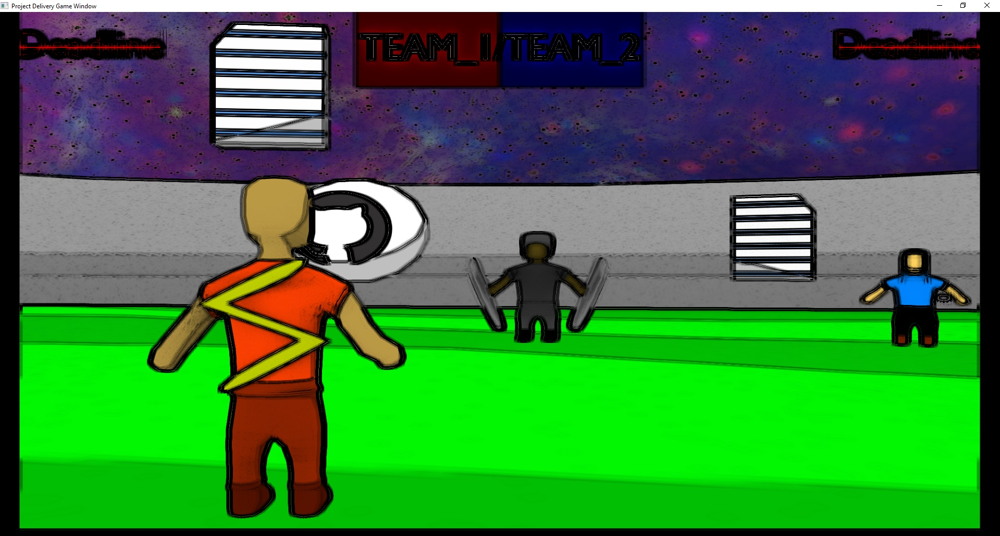

# CG-Project
### About the project:
The project was to make a game engine using Opengl and a sample game. Written in c++.

### The game engine structure:
The approach used was similar to that of * *Unity3D* * game engine. With Game Objects each having a list to components. All game components are inherited from Component class.

### Sample game synopsis:
“**_Project delivery_**” is a catch the flag type of gameplay where two teams, 3 players each clash to finish their incomplete projects by pirating other teams’ work while securing theirs. 

### Working game footage:

### List of game features:
- Toon shading
- Edge Detection
- Lan network
- Bone animations

## Game story:	
The end of the semester is coming and the deadlines come with it. The teams are struggling to finish their projects on time but for (team 6) even trying is futile, they are a hundred leagues behind. So they decided to unleash the cyberwarfare on their counterparts to pirate their work. Their plans were discovered and a raven was sent to notify other teams of their vile intentions to raise their defenses and get ready for the battle to come. In the game of deliveries, you win or you die, there is no middle ground. 

## Game Description:
A team consists of 3 players, speed coder who is able to copy other people’s code at a dazzling speed, the strong debugger with his massive breakpoints-shooting bazooka who has the capability to hinder the target’s workflow, Mr. cipher with his reinforced shield protecting other team members during the attack.
The scoring system is based on the number of pirated files. A certain score is required for winning.
